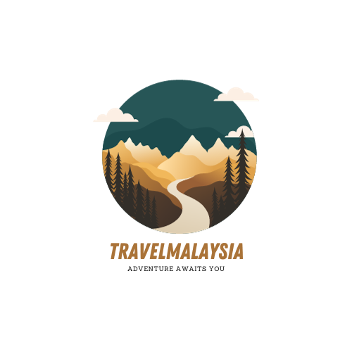
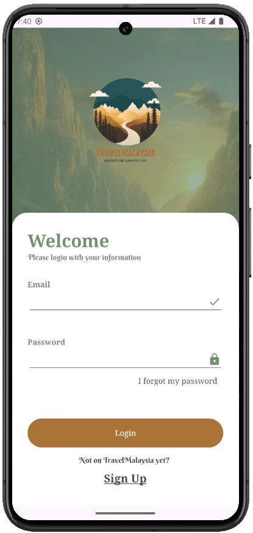
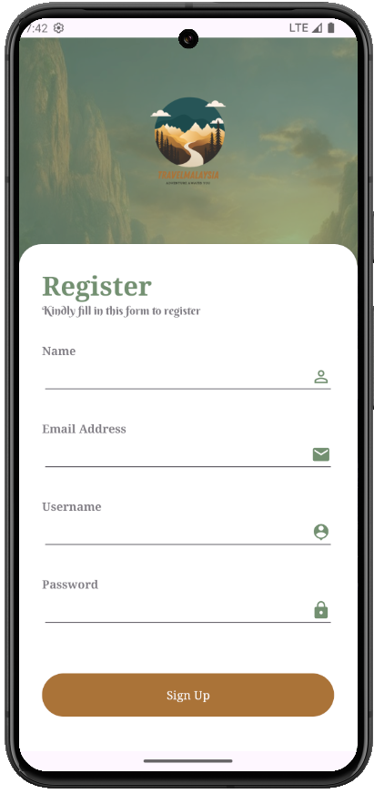
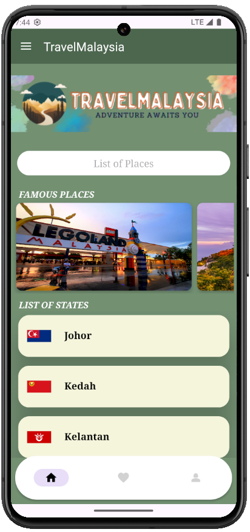
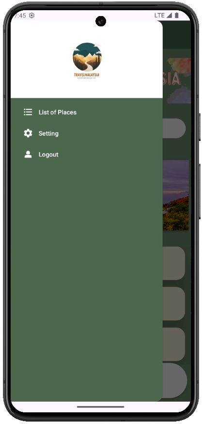
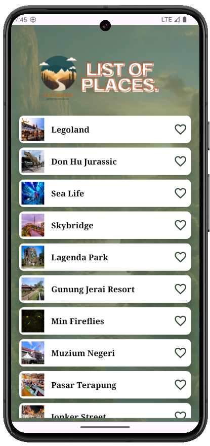
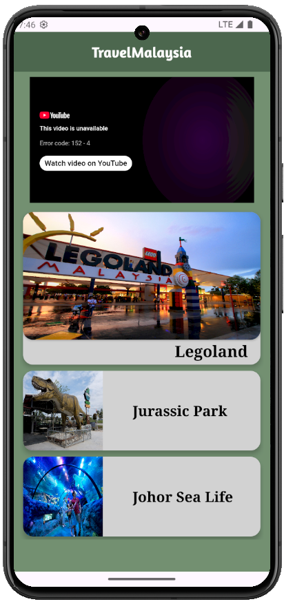
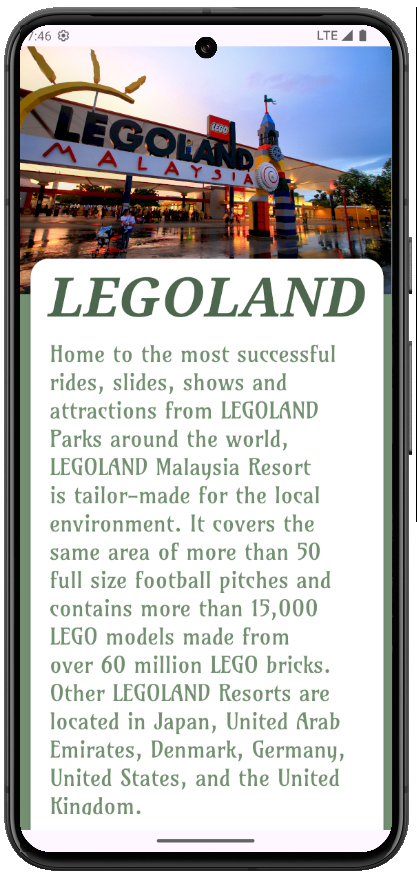
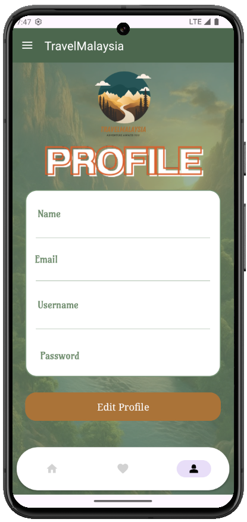

<div align="center">

  

  # 🇲🇾 Travel Malaysia App
  **Your Ultimate Pocket Companion to Explore Malaysia's Gems & Culture**

  <p align="center">
    A native Android travel discovery application featuring interactive state-by-state guides, landmark showcases, embedded video previews, offline favorites, and cloud-synced user profiles.
  </p>

  [](https://developer.android.com/)
  [](https://www.java.com/)
  [](https://developer.android.com/)
  [](https://developer.android.com/)
  [](https://firebase.google.com/)
  [](LICENSE)

</div>

---

## 📖 Table of Contents
- [Overview](#-overview)
- [App Showcase & UI](#-app-showcase--ui)
- [Key Features](#-key-features)
- [Tech Stack & Libraries](#-tech-stack--libraries)
- [Project Architecture](#-project-architecture)
- [Prerequisites & Getting Started](#-prerequisites--getting-started)
- [How to Run the App](#-how-to-run-the-app)
- [How to Capture Screenshots for Portfolio](#-how-to-capture-screenshots-for-portfolio)
- [Portfolio Showcase Snippet](#-portfolio-showcase-snippet)
- [Contributing & License](#-contributing--license)

---

## 🌟 Overview

**Travel Malaysia** is a comprehensive native Android travel guide designed to celebrate and simplify traveling across Malaysia's 14 states and federal territories. Whether you are exploring the limestone cliffs of Batu Caves in Selangor, snorkeling around Pulau Redang in Terengganu, or scaling Mount Kinabalu in Sabah, the app provides curated itineraries, multimedia video guides, and location highlights.

Built with performance and user experience in mind, the app leverages **Firebase Authentication & Realtime Database** for user accounts, **SQLite** for offline bookmarking, and the **YouTube Player SDK** for in-app video walkthroughs.

---

## 📱 App Showcase & UI

<div align="center">

### Authentication & Core Navigation
<table>
  <tr>
    <td align="center" width="25%">
      
      <br/><b>1. Welcome & Login</b>
      <br/><sub>Firebase Email & Password Auth</sub>
    </td>
    <td align="center" width="25%">
      
      <br/><b>2. User Registration</b>
      <br/><sub>Account creation & validation</sub>
    </td>
    <td align="center" width="25%">
      
      <br/><b>3. Home Discovery</b>
      <br/><sub>14-state guide & highlights</sub>
    </td>
    <td align="center" width="25%">
      
      <br/><b>4. Navigation Drawer</b>
      <br/><sub>Quick-access menu & logout</sub>
    </td>
  </tr>
</table>

### Discovery, Media & User Profile
<table>
  <tr>
    <td align="center" width="25%">
      
      <br/><b>5. Places Directory</b>
      <br/><sub>Instant search & favorites</sub>
    </td>
    <td align="center" width="25%">
      
      <br/><b>6. State Hub & Video</b>
      <br/><sub>Integrated YouTube player</sub>
    </td>
    <td align="center" width="25%">
      
      <br/><b>7. Destination Guide</b>
      <br/><sub>Comprehensive place overview</sub>
    </td>
    <td align="center" width="25%">
      
      <br/><b>8. Profile Management</b>
      <br/><sub>Firebase Realtime DB sync</sub>
    </td>
  </tr>
</table>

</div>

---

## ⚡ Key Features

- **🗺️ Complete 14-State Directory**:
  - Detailed guides across Johor, Kedah, Kelantan, Kuala Lumpur, Melaka, Negeri Sembilan, Pahang, Penang, Perak, Perlis, Sabah, Sarawak, Selangor, and Terengganu.
- **🔍 Instant Search & Discovery**:
  - Dynamic keyword search filtering top tourist hotspots, theme parks, natural reserves, beaches, and historic monuments.
- **🎬 Integrated Video Walkthroughs**:
  - In-app YouTube video tours powered by the `android-youtube-player` library, allowing travelers to preview attractions before visiting.
- **❤️ Offline Bookmarking & Favorites**:
  - Local SQLite database (`FavDB`) implementation allowing users to save places and view them without an active internet connection.
- **🔐 Cloud Authentication & User Accounts**:
  - Firebase Authentication supporting email/password sign-in, account creation, and password reset flows.
- **👤 Profile Personalization**:
  - Profile detail editing synced with Firebase Realtime Database.
- **🎨 Fluid Animations & Modern UI**:
  - MotionLayout splash transitions, Material Design components, CardViews, and clean ViewBinding architecture.

---

## 🛠️ Tech Stack & Libraries

| Category | Technology | Purpose |
| :--- | :--- | :--- |
| **Language** | Java (JDK 17 / 21) | Core application programming |
| **Platform** | Android SDK (Min 24, Target 34) | Cross-device compatibility |
| **UI Framework** | Android XML + ViewBinding + MotionLayout | Layouts, fluid animations, and safe view bindings |
| **Components** | Material Components & CardView | Modern Android UI cards and elements |
| **Navigation** | AndroidX Navigation Component | Fragment transactions and deep linking |
| **Backend & Auth** | Google Firebase (Auth & Realtime DB) | Cloud authentication & synchronized profile data |
| **Local Storage** | SQLite (`FavDB`) | Offline storage for saved favorite places |
| **Multimedia** | Android YouTube Player (`com.pierfrancescosoffritti.androidyoutubeplayer`) | Embedded high-performance YouTube playback |
| **CI / CD** | GitHub Actions | Automated build verification on push and PR |

---

## 📂 Project Architecture

```
travelmalaysiaapp/
├── .github/
│   └── workflows/
│       └── android.yml            # Automated CI build workflow
├── app/
│   ├── src/
│   │   ├── main/
│   │   │   ├── java/com/example/travelmalaysia/
│   │   │   │   ├── Johor/         # Attractions for Johor
│   │   │   │   ├── Kedah/         # Attractions for Kedah
│   │   │   │   ├── KualaLumpur/   # Attractions for Kuala Lumpur
│   │   │   │   ├── Melaka/        # Attractions for Melaka
│   │   │   │   ├── Penang/        # Attractions for Penang
│   │   │   │   ├── Sabah/         # Attractions for Sabah
│   │   │   │   ├── Sarawak/       # Attractions for Sarawak
│   │   │   │   ├── Selangor/      # Attractions for Selangor
│   │   │   │   ├── state/         # State hub activities
│   │   │   │   ├── fragment/      # BottomNav fragments (Home, Fav, Profile)
│   │   │   │   ├── Objects/       # Data models (Place, User, FavPlace)
│   │   │   │   ├── FavDB.java     # SQLite database helper for bookmarks
│   │   │   │   ├── MainActivity.java
│   │   │   │   ├── LogInActivity.java
│   │   │   │   ├── SignUpActivity.java
│   │   │   │   └── SearchActivity.java
│   │   │   ├── res/               # XML layouts, drawables, navigation graphs
│   │   │   └── AndroidManifest.xml
│   │   └── test/                  # Unit and instrumented tests
│   ├── build.gradle.kts           # App-level dependencies and SDK configuration
│   └── google-services.json       # Firebase configuration file
├── docs/
│   └── images/                    # UI screenshots & showcase assets
├── build.gradle.kts               # Project-level Gradle build configuration
├── settings.gradle.kts            # Project repositories & modules
└── LICENSE                        # MIT License
```

---

## ⚙️ Prerequisites & Getting Started

### Prerequisites
- **Android Studio** (Hedgehog / Iguana / Jellyfish / Ladybug or newer)
- **Java Development Kit (JDK)**: JDK 17 or JDK 21
- **Android SDK**: API 34 installed via SDK Manager
- An Android Emulator (e.g. Pixel 8 / 9 with API 33+) or a physical Android device with USB Debugging enabled

---

## 🚀 How to Run the App

### Method 1: Using Android Studio (Recommended)

1. **Launch Android Studio**.
2. Select **Open** and choose the project directory:
   ```
   C:\AntiGravity\Travel Malaysia
   ```
3. Allow Gradle to sync dependencies automatically.
4. Select your target device or emulator from the device dropdown (e.g., `Pixel_8_API_33`).
5. Click the green **Run (▶️)** button or press `Shift + F10`.
6. The app will compile, install, and open on the emulator!

### Method 2: Using the Command Line (Terminal / PowerShell)

1. Open PowerShell in the project directory:
   ```powershell
   cd "C:\AntiGravity\Travel Malaysia"
   ```
2. Build the Debug APK:
   ```powershell
   .\gradlew.bat assembleDebug
   ```
   The APK will be generated at:
   ```
   app/build/outputs/apk/debug/app-debug.apk
   ```
3. Start your Android Emulator:
   ```powershell
   & "$env:LOCALAPPDATA\Android\Sdk\emulator\emulator.exe" -avd Pixel_8_API_33
   ```
4. Install and launch the app via ADB:
   ```powershell
   & "$env:LOCALAPPDATA\Android\Sdk\platform-tools\adb.exe" install -r app\build\outputs\apk\debug\app-debug.apk
   & "$env:LOCALAPPDATA\Android\Sdk\platform-tools\adb.exe" shell am start -n com.example.travelmalaysia/.OpenAppActivity
   ```

---

## 📸 How to Capture Screenshots for Portfolio

To take crystal-clear screenshots directly from your running emulator:

1. **In Android Studio**:
   - Open the **Logcat** or **Running Devices** window.
   - Click the **Camera Icon (Take Screenshot)** on the side toolbar.
   - Click **Save** to export high-res PNGs of each screen (Splash, Home, State List, Destination Detail, Favorites, Profile).
2. **Via Command Line**:
   ```powershell
   # Capture current screen to emulator SD card
   & "$env:LOCALAPPDATA\Android\Sdk\platform-tools\adb.exe" shell screencap -p /sdcard/screen.png

   # Pull the image to your project docs folder
   & "$env:LOCALAPPDATA\Android\Sdk\platform-tools\adb.exe" pull /sdcard/screen.png docs/images/homepage_screenshot.png
   ```

---

## 🌐 Portfolio Showcase Snippet

Use this ready-to-paste card layout or markdown snippet in your portfolio website:

### Markdown / Readme Showcase
```markdown
### 🇲🇾 Travel Malaysia — Native Android Mobile App
An all-in-one tourism companion for Malaysia covering 14 states with interactive attractions, offline bookmarking, and embedded multimedia tours.

- **Tech Stack:** Java, Android SDK (API 34), Firebase Auth & Realtime Database, SQLite, ViewBinding, YouTube API
- **Repository:** [umairasri/travelmalaysiaapp](https://github.com/umairasri/travelmalaysiaapp)
- **Key Highlights:** State exploration hub, offline bookmarking, real-time search, cloud authentication.
```

### HTML / React Portfolio Card
```html
<div class="project-card">
  
  <div class="project-content">
    <h3>Travel Malaysia Android App</h3>
    <p>Comprehensive travel discovery mobile app covering attractions, heritage spots, and video walkthroughs across 14 Malaysian states.</p>
    <div class="tags">
      <span>Java</span>
      <span>Android SDK</span>
      <span>Firebase</span>
      <span>SQLite</span>
      <span>Material UI</span>
    </div>
    <div class="links">
      <a href="https://github.com/umairasri/travelmalaysiaapp" target="_blank" rel="noreferrer">View on GitHub</a>
    </div>
  </div>
</div>
```

---

## 📄 Contributing & License

Contributions, issues, and feature requests are welcome! Feel free to check the [issues page](https://github.com/umairasri/travelmalaysiaapp/issues).

Distributed under the **MIT License**. See [`LICENSE`](LICENSE) for more information.

---

<div align="center">
  Made with ❤️ for travelers exploring Malaysia 🇲🇾
</div>
